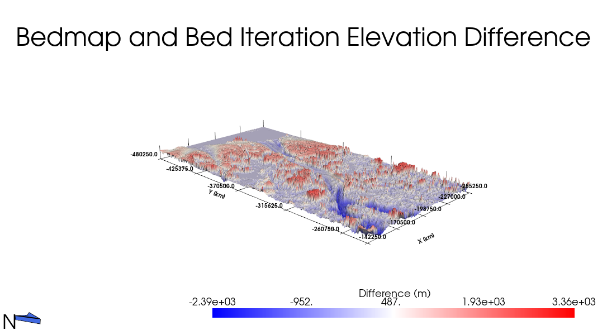

# AntarcticPyVistaVisualization
Workflow for mapping regions of the Antarctic continent based on bed and surface topography, with a focus on bed elevation. This project uses GeoTIFF Digital ELevation Maps (DEMs) to plot regions of Antarctica in 3D space to help visualize the topographic difference between bed and surface in an interactive and visually cohesive manner. The following graph is a section of the Ronne Ice Shelf chosen to display the capabilities of the project.

This project also seeks to plot and compare the bed elevation data created by stochastic realizations of glacial bed topography as part of an ongoing project to improve textural representations of sub-glacial topography. More information can be found at https://github.com/GatorGlaciology/DEMOGORGN-Antarctica. The following graph is the difference between Bedmap, an Antarctic bed topography dataset, and one stochastic bed realization of Scott Glacier.

# Data Access
The data used in this project can be accessed via GEBCO's interactive grid (https://download.gebco.net/). To download the dataset used in this project, change the data in the top left corner of the screen to 'GEBCO 2025 South Polar', select subset options, change the top and right bounds to 4400000 and the left and bottom bounds to -4400000. Issues may arise if bounds are different. Click 'layers and formats', select both 'Bathymetry' and 'Bathymetry (sub ice)'. Only 'GeoTIFF' is required for the data format. Click add to basket and then make sure the basket icon in the top right is green, click it, then submit. Go to the download section to the right of the basket and the data is available there after some time. Below is a screenshot of the process for clarity.

The data for the example bed is being used as part of an ongoing project, DEMOGORGN, to iteratively determine subglacial topography for various fast flowing glacial regions. Scott Glacier is one of these and the example used in the project.

# Jupyter Notebook Activation
All dependencies are listed in the geo-python-polar.yml file for use in a Conda Jupyter Notebook environment.

To activate, open the command line and using the 'cd' command, navigate to the folder with the geo-python-polar.yml file. Then, type the following into the command line:

- conda env create -f geo-python-polar.yml

- conda activate geo-python-polar

- jupyter lab

This will launch Jupyter Notebook in the browser. When reopenning the environment after is has been created, only use the second and third lines of code.

# Usage

Before running the code, find the polar stereographic coordinates of the region you are interested in displaying and, if applicable, have a csv of a study region containing the bedmap bed topography for the region and a bed realization. The following are cells where significant change can and might need to be made. If issues arise, check and change them first:

- In cells 5 or 6, replace 'xminpolar', 'xmaxpolar', 'yminpolar', and 'ymaxpolar' with the new coordinates. The GEBCO interactive grid can be used to visualize coordinate region and is a helpful reference for where a region is on the continental scale.

- In cell 18, change the coefficients for 'xminpolar', 'yminpolar', and the 'cmax' exponent to change the position of the camera in the following plot. They are already based on region-specific data, so only fine-tuning should be required, though exceptions exist.

- In cell 19, change 'zscale' to better match elevation difference in region, 'color' and 'opacity' for surface transparency, 'cmap' if you want to, and any other numerical value.

- In cells 20 and 22, change the csv and bed realization file locations respectively.

- In cell 24, change camera position as in cell 18.

- In cells 25 and 28, change variables as in cell 19

# Authorship and Liscense
This project was authored by Milo Rasz. Liscense information is in the corresponding LISCENSE file. No generative AI was used in this project.
